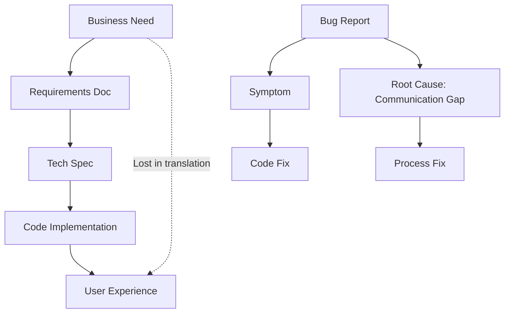
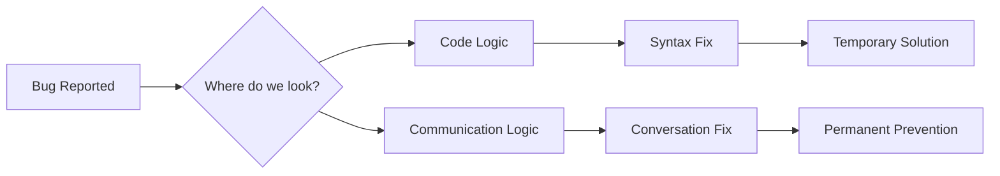

Most bugs aren't logic errors. They're miscommunication between developers and requirements.

We build what we think was asked for, not what was actually needed.

## The Communication Stack



## The Translation Layers

Each handoff introduces potential misunderstanding:

**Business → Requirements**
- "User-friendly" means different things to different people
- Assumptions fill gaps in specifications
- Edge cases get overlooked in overview meetings

**Requirements → Development**
- Technical constraints vs. business wishes
- "Should work like X" without defining X
- Implicit knowledge that never gets documented

## The Debugging Paradox



**The real debugging happens in meetings, not in code.**

## Common Miscommunication Patterns

| What was said | What was heard | What was built |
|---------------|----------------|----------------|
| "Like Amazon checkout" | "Exactly like Amazon" | Overcomplicated flow |
| "Simple interface" | "Minimal features" | Missing functionality |
| "Fast loading" | "Sub-second response" | Over-optimized for wrong metric |

## The Bug Lifecycle

```
1. Unclear requirement
2. Assumption-based implementation  
3. Works in developer's context
4. Fails in user's context
5. Bug ticket created
6. Symptom patched
7. Same misunderstanding resurfaces
```

## Breaking the Cycle

**Before coding:**
- Define success scenarios explicitly
- Document the "why" behind requirements  
- Test understanding with examples
- Clarify edge cases upfront

**During development:**
- Question ambiguous specifications
- Share progress early and often
- Demo frequently with stakeholders
- Document decisions and assumptions

---

*The computer does exactly what we tell it to do, not what we meant. The gap between intention and instruction is where bugs live.*

**Fix the conversation, fix the code.**
