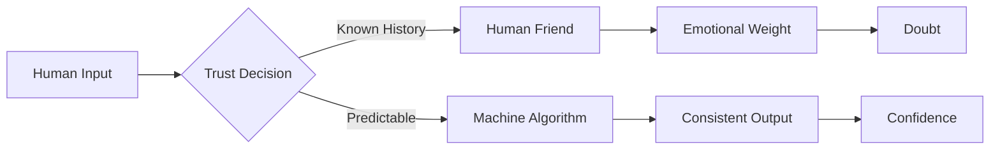
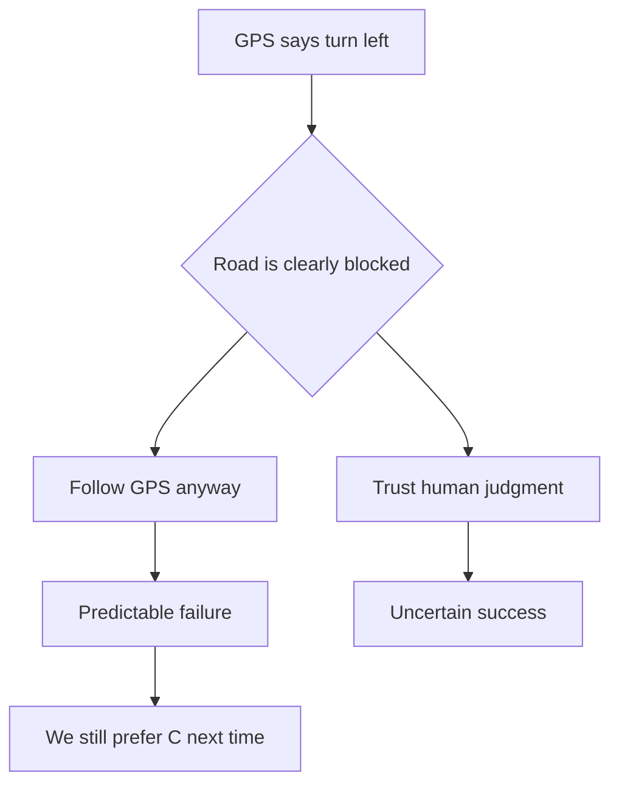

I trust my GPS more than a stranger giving directions.
I trust spell-check more than my own memory.
I trust my password manager more than my ability to remember passwords.

## The Trust Paradox



Machines don't have bad days. They're consistent, even when they're consistently wrong.

## Why We Default to Digital

**People factors:**
- Mood swings affect judgment
- Personal bias clouds advice  
- Memory fades over time
- Emotional investment in being right

**Machine factors:**
- Same input = same output
- No ego involved in decisions
- Available 24/7 without fatigue
- Fail in predictable patterns

## The Automation Bias

We've developed **automation bias** - the tendency to over-rely on automated systems even when we have contradictory information.



## The Trust Transfer

```
Human Relationship Trust: Years to build, seconds to break
Machine Algorithm Trust: Minutes to build, patterns to maintain
```

**The irony?** Machines are created by humans - the same humans we don't trust to give us directions.

We've outsourced trust to intermediaries that promise consistency over accuracy, predictability over wisdom.

---

*Maybe the question isn't whether machines are more trustworthy, but why we find predictable failure more comforting than unpredictable success.*
